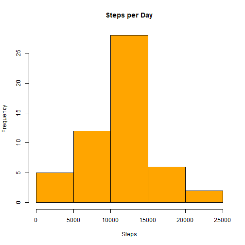
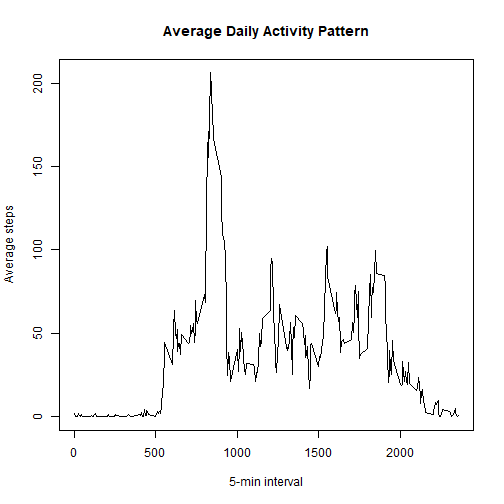
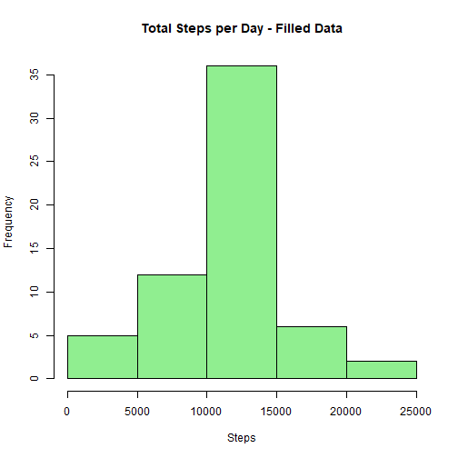
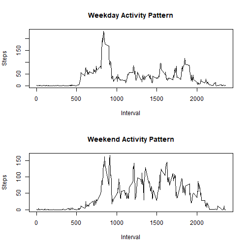

## Loading and preprocessing the data

``` r
#Load data set
data <- read.csv("activity.csv")

#Convert date to Date type
data$date <- as.Date(data$date)
```


## What is mean total number of steps taken per day?
The mean and median represents the central tendency of total daily steps, ignoring missing values. 

``` r
#Remove NA
data_noNA <- data [!is.na(data$steps),]

#Calculate total steps per day
steps_per_day <- tapply(data_noNA$steps, data_noNA$date, sum)

#Histogram of total number of steps taken per day
hist (steps_per_day,
      main= "Steps per Day",
      xlab="Steps",
      col= "orange")
```



``` r
#Calculate Mean and Median
mean(steps_per_day)
```

```
## [1] 10766.19
```

``` r
median(steps_per_day)
```

```
## [1] 10765
```

## What is the average daily activity pattern?
The interval with the maximum average steps represents the peak activity time of the day.

``` r
#Average steps per interval
interval_avg <- tapply(data_noNA$steps, data_noNA$interval, mean)

#Convert to numeric for plotting
interval_index <- as.numeric(names(interval_avg))

#Time series plot
plot(interval_index, interval_avg,
     type= "l",
     main= "Average Daily Activity Pattern",
     xlab= "5-min interval",
     ylab= "Average steps")
```



``` r
# 5-minute interval with the maximum number of steps
max_interval<- interval_index[which.max(interval_avg)]
max_interval
```

```
## [1] 835
```


## Imputing missing values
Missing values are replaced with the mean number of steps for that specific 5-minute interval.

``` r
#Count NA
total_NA <- sum(is.na(data$steps))
total_NA
```

```
## [1] 2304
```

``` r
#Mean per interval (including NA removal)
interval_mean <- tapply(data$steps, data$interval, mean, na.rm=TRUE)


data_filled <- data

#Fill NA values
for (i in 1:nrow(data_filled)) {
  if (is.na(data_filled$steps[i])) {
    interval <- data_filled$interval[i]
    data_filled$steps[i] <- interval_mean[as.character(interval)]
  }
}
```

After imputing missing values, the mean and median may change slightly, indicating reduced bias from missing data.

``` r
#Total steps per day - new datasets
steps_per_day_filled <- tapply(data_filled$steps, data_filled$date, sum)

#Histogram
hist(steps_per_day_filled,
     main= "Total Steps per Day - Filled Data",
     xlab= "Steps",
     col= "lightgreen")
```



``` r
#Mean and median
mean_filled <- mean(steps_per_day_filled)
median_filled <- median(steps_per_day_filled)

mean_filled
```

```
## [1] 10766.19
```

``` r
median_filled
```

```
## [1] 10766.19
```


## Are there differences in activity patterns between weekdays and weekends?


``` r
data_filled$day_type <- ifelse(weekdays(data_filled$date) %in% 
        c("Saturday", "Sunday"),
        "weekend", "weekday")

#Split data
weekday_data <- data_filled[data_filled$day_type == "weekday",]
weekend_data <- data_filled[data_filled$day_type == "weekend",]

#Tapply with mean
weekday_avg <- tapply(weekday_data$steps, weekday_data$interval, mean)
weekend_avg <- tapply(weekend_data$steps, weekend_data$interval, mean)


#Plot
par(mfrow= c(2,1))

#Weekday
plot(as.numeric(names(weekday_avg)), weekday_avg,
     type= "l",
     main= "Weekday Activity Pattern",
     xlab= "Interval",
     ylab= "Steps")

#Weekend
plot(as.numeric(names(weekend_avg)), weekend_avg,
     type= "l",
     main= "Weekend Activity Pattern",
     xlab= "Interval",
     ylab= "Steps")
```


